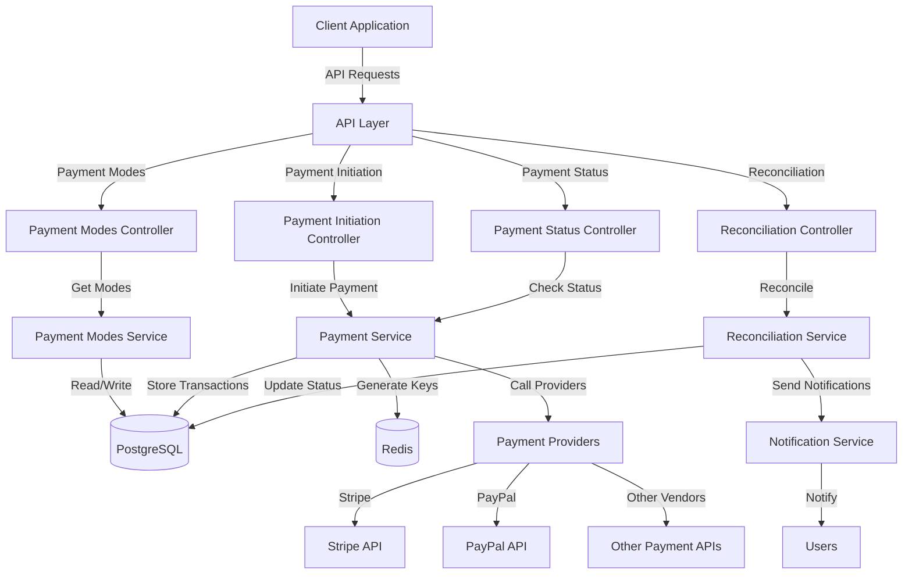

# Payment Gateway System - High-Level Design (HLD)

## 1. Executive Summary

The Payment Gateway System is designed to facilitate payment processing across multiple payment providers such as Stripe and PayPal. The system acts as an intermediary layer between users and various payment vendors, providing a unified interface for payment operations while abstracting the complexities of individual payment providers.

The primary business objective is to create a reliable, secure, and scalable payment processing system that supports multiple payment methods and vendors while ensuring transaction integrity. The system aims to prevent double payments through proper concurrency handling and includes reconciliation capabilities for pending transactions.

The solution approach involves a Spring Boot-based RESTful API architecture that manages payment modes, initiates payments with idempotency guarantees, tracks payment status, and reconciles pending transactions. The system will utilize PostgreSQL for persistent storage and Redis for generating unique payment identifiers.

## 2. System Overview and Key Capabilities

### Problem Statement
The system solves the challenge of integrating with multiple payment providers while providing a unified, reliable interface for payment processing. It addresses the critical issues of payment method availability, transaction idempotency, payment status tracking, and transaction reconciliation.

### Core Capabilities
Based on the requirements document, the system provides the following core capabilities:
- Multi-vendor payment processing (Stripe, PayPal, etc.)
- Payment mode discovery based on user and product context
- Payment initiation with idempotency guarantees
- Payment status tracking
- Transaction reconciliation

### Key Features
The system offers the following key features as specified in the requirements:
- Payment modes discovery API
- Payment initiation API
- Payment status checking API
- Transaction reconciliation capability
- Support for multiple payment methods (UPI, credit card, debit card)

### Success Criteria
The success of the system will be measured by:
- Successful integration with multiple payment vendors
- Prevention of double payments
- Accurate payment status reporting
- Successful reconciliation of pending transactions
- Proper notification delivery to users

### Assumptions and Constraints
Based on the requirements document, the following constraints and limitations are identified:
- The system is required to use PostgreSQL for data storage
- Redis is specified for generating unique payment identifiers
- The system must handle concurrency issues
- The system must support multiple payment vendors and methods

**Missing Information:**
- Performance requirements (response times, throughput)
- Specific availability targets
- Detailed security requirements beyond basic user authentication
- Regulatory compliance requirements
- Specific vendors to be supported beyond the examples (Stripe, PayPal)

## 3. Requirements Analysis

### 3.1 Functional Requirements

#### Payment Processing
- **Must**: User should be able to make payments using multiple vendors like Stripe, PayPal, etc.
- **Must**: System should be able to handle all payment-related requests like create payment, update payment, etc.
- **Must**: System should handle concurrency issues and prevent double payments
- **Must**: System should be able to reconcile pending transactions and send notifications to users

#### Payment Modes API
- **Must**: System must provide an API to check available payment modes for a user
- **Must**: System must filter payment modes based on product type
- **Must**: System must check available payment modes for the vendor
- **Must**: System must return available payment modes in JSON format

#### Payment Initiation API
- **Must**: System must check payment modes available for the user and product type
- **Must**: System must create a unique payment idempotency key
- **Must**: System must use Redis to generate payment keys
- **Must**: System must verify key uniqueness in the database
- **Must**: System must call the payment provider to initiate payment
- **Must**: System must store the payment idempotency key in the transactions table
- **Must**: System must return the payment idempotency key in the response

#### Payment Status API
- **Must**: System must check payment status for a given payment idempotency key
- **Must**: System must return payment status in the response

#### Payment Reconciliation
- **Must**: System must check pending transactions
- **Must**: System must update transaction status based on vendor response
- **Must**: System must return payment status in the response

### 3.2 Non-Functional Requirements

Based strictly on the requirements document, the following non-functional requirements are identified:

#### Performance
- No specific performance metrics are mentioned in the requirements

#### Scalability
- No specific scalability requirements are mentioned

#### Availability
- No specific availability targets are mentioned

#### Security
- Basic authentication is implied through the use of userId in API headers
- No specific security mechanisms are detailed in the requirements

#### Compliance
- No specific regulatory compliance requirements are mentioned

#### Other
- The system must use PostgreSQL for data storage
- The system must use Redis for generating unique payment identifiers

## 4. High-Level Architecture

### 4.1 System Architecture Diagram

### 4.2 Architecture Patterns

Based on the requirements document, the system appears to follow:

- **Architectural Style**: The requirements suggest a layered architecture with controllers, services, and data access layers, typical of a Spring Boot application.
- **Design Patterns**: While not explicitly stated, the requirements imply:
  - Gateway pattern for abstracting multiple payment providers
  - Repository pattern for data access
  - Idempotency pattern for preventing duplicate transactions

- **Communication Patterns**: The requirements specify synchronous RESTful APIs for client communication.

### 4.3 Data Architecture

Based on the requirements document:

- **Data Storage**: PostgreSQL is specified for persistent storage
- **Data Flow**: 
  1. Client requests flow through RESTful APIs
  2. Payment data is stored in the transactions table
  3. Reconciliation data is stored in the reconciliation table
  4. Payment modes are stored in the payment_modes table

- **Data Consistency**: 
  - Idempotency keys are used to prevent duplicate transactions
  - Database checks ensure key uniqueness

- **Data Entities**:
  - Transactions
  - Reconciliation records
  - Payment modes

## 5. Component Breakdown

### 5.1 System Components

#### API Layer
- **Purpose**: Expose RESTful endpoints for payment operations
- **Responsibilities**: 
  - Handle HTTP requests and responses
  - Validate input data
  - Route requests to appropriate services
- **Interfaces**: 
  - GET /v1/payment/modes
  - POST /v1/payment/initiate
  - GET /v1/payment/status
  - Endpoint for reconciliation (not explicitly defined in requirements)
- **Data**: Handles request/response DTOs

#### Payment Service
- **Purpose**: Core payment processing logic
- **Responsibilities**:
  - Generate idempotency keys
  - Initiate payments with vendors
  - Store transaction records
  - Check payment status
- **Interfaces**: Internal service interfaces
- **Data**: Transactions, payment provider responses

#### Payment Modes Service
- **Purpose**: Manage available payment methods
- **Responsibilities**:
  - Determine available payment modes for users
  - Filter by product type
  - Filter by vendor capabilities
- **Interfaces**: Internal service interfaces
- **Data**: Payment modes

#### Reconciliation Service
- **Purpose**: Reconcile pending transactions
- **Responsibilities**:
  - Check status of pending transactions
  - Update transaction status
  - Trigger notifications
- **Interfaces**: Internal service interfaces
- **Data**: Reconciliation records

#### Notification Service
- **Purpose**: Send notifications to users
- **Responsibilities**:
  - Send payment status notifications
- **Interfaces**: Not specified in requirements
- **Data**: Not specified in requirements

### 5.2 API Design

Based on the requirements document, the following APIs are specified:

#### Payment Modes API
- **Endpoint**: GET /v1/payment/modes
- **Headers**: userId, productType
- **Response**: JSON with available payment modes
- **Flow**:
  1. Check payment modes available for the user
  2. Check payment modes available for the product type
  3. Check available payment modes for the vendor
  4. Return JSON response with available payment modes

#### Payment Initiation API
- **Endpoint**: POST /v1/payment/initiate
- **Headers**: userId
- **Request Body**: JSON with amount, transactionType, and additional data
- **Response**: JSON with payment ID, status, amount, and description
- **Flow**:
  1. Check payment modes available for user and product type
  2. Create unique payment idempotency key using Redis
  3. Verify key uniqueness in database
  4. Call payment provider to initiate payment
  5. Store payment details in transactions table
  6. Return payment details in response

#### Payment Status API
- **Endpoint**: GET /v1/payment/status
- **Headers**: userId, paymentID
- **Response**: JSON with payment status
- **Flow**:
  1. Check payment status for the given idempotency key
  2. Return payment status in response

#### Reconciliation API
- **Endpoint**: Not explicitly defined in requirements
- **Flow**:
  1. Check pending transactions
  2. Update transaction status based on vendor responses
  3. Return payment status in response

### 5.3 Database Design

Based on the requirements document, the following database schema is specified:

#### Transactions Table
- id
- idempotency_key (uniquely generated payment ID)
- status
- userId
- amount
- payment_mode
- vendorTransactionId
- payment_provider

#### Reconciliation Table
- id
- vendor_transaction_id
- vendor_status
- created_at

#### Payment Modes Table
- id
- UUID
- payment_mode (UPI, CREDIT_CARD)
- type (CREDIT, DEBIT)

### 5.4 Integration Points

Based on the requirements document, the following integration points are identified:

#### Payment Providers
- Integration with multiple payment vendors (Stripe, PayPal mentioned as examples)
- The requirements specify mocking vendor responses for development

#### Redis
- Used for generating unique payment identifiers
- Incremental counter for payment key generation

## 6. Technology Choices

### 6.1 Technology Requirements

Based strictly on the requirements document:

| Component | Technology Specified | Requirement Source |
|-----------|---------------------|-------------------|
| Backend | Not explicitly specified | N/A |
| Frontend | Not specified | N/A |
| Database | PostgreSQL | Database Schema section |
| Cache | Redis | API Flows section (payment/initiate) |
| Message Queue | Not specified | N/A |
| Monitoring | Not specified | N/A |

### 6.2 Technology Gaps

The requirements document does not specify:
- Backend framework or language (though the project structure suggests Spring Boot with Kotlin)
- Frontend technology
- Message queue for asynchronous processing
- Monitoring tools
- Logging framework
- CI/CD tools
- Infrastructure/deployment platform

## 7. Scalability and Performance

The requirements document does not specify any scalability or performance requirements. However, the use of Redis for ID generation suggests some consideration for performance.

**Missing Information:**
- Expected transaction volume
- Peak load expectations
- Response time requirements
- Throughput requirements
- Scaling strategies

## 8. Availability and Fault Tolerance

The requirements document does not specify availability targets or fault tolerance mechanisms.

**Missing Information:**
- Uptime requirements
- Redundancy requirements
- Failover strategies
- Disaster recovery plans

## 9. Security Requirements

The requirements document implies basic authentication through the use of userId in API headers, but does not specify detailed security requirements.

**Missing Information:**
- Authentication mechanism details
- Authorization requirements
- Data encryption requirements
- Security compliance standards

## 10. Constraints and Limitations

Based on the requirements document, the following constraints are identified:

### Technical Constraints
- PostgreSQL must be used for data storage
- Redis must be used for generating unique payment identifiers

### Business Constraints
- The system must support multiple payment vendors
- The system must prevent double payments
- The system must reconcile pending transactions

### Limitations in Requirements
- No performance metrics specified
- No availability targets specified
- Limited security requirements
- No specific compliance requirements
- No deployment or infrastructure requirements
- No monitoring or observability requirements
