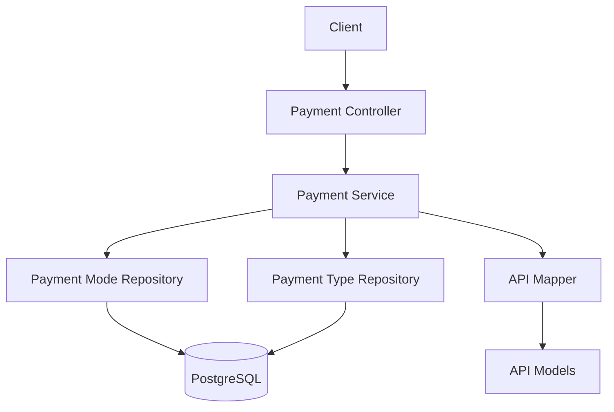

# System Patterns

**Created:** 2025-05-24  
**Status:** ACTIVE  
**Author:** Rajat Garg  
**Last Modified:** 2025-05-31
**Last Updated By:** Cascade AI Assistant

## Table of Contents
- [Architectural Overview](#architectural-overview)
- [System Components](#system-components)
- [Data Flow](#data-flow)
- [Integration Patterns](#integration-patterns)
- [Design Decisions](#design-decisions)
- [Cross-Cutting Concerns](#cross-cutting-concerns)
- [Scalability Considerations](#scalability-considerations)
- [Idempotency Pattern](#idempotency-pattern)
- [Concurrency Control Patterns](#concurrency-control-patterns)
- [Error Handling Patterns](#error-handling-patterns)
- [Data Access Patterns](#data-access-patterns)
- [Testing Patterns](#testing-patterns)

## Architectural Overview
The system follows a clean architecture with clear separation of concerns:
- **API Layer**: Handles HTTP requests/responses, input validation, and authentication
- **Service Layer**: Contains business logic and orchestrates operations
- **Repository Layer**: Manages data access and persistence
- **Domain Layer**: Contains core business models and interfaces

### Architecture Diagram

## System Components
### Payment Controller
- **Purpose:** Handles HTTP requests and responses for payment operations
- **Responsibilities:**
  - Validates input parameters
  - Converts between API and domain models
  - Handles exceptions and error responses
- **Dependencies:** PaymentService, PaymentModeApiMapper

### Payment Service
- **Purpose:** Implements business logic for payment operations
- **Responsibilities:**
  - Orchestrates payment mode and type retrieval
  - Applies business rules and validations
  - Manages transactions
- **Dependencies:** PaymentModeRepository, PaymentTypeRepository

### Payment Mode/Type Repositories
- **Purpose:** Manages data access for payment modes and types
- **Responsibilities:**
  - Executes database queries using jOOQ
  - Converts between database and domain models
  - Handles database transactions
- **Dependencies:** jOOQ DSLContext

### API Mapper
- **Purpose:** Converts between domain and API models
- **Responsibilities:**
  - Maps domain models to API response objects
  - Handles null safety and default values
  - Maintains separation between layers
- **Dependencies:** API generated models, Domain models

## Data Flow
### Payment Modes Retrieval
1. Client sends GET request to `/api/v1/payment/modes`
2. Controller validates headers and passes to service
3. Service retrieves active payment modes from repository
4. For each mode, service retrieves associated payment types
5. Service builds response structure
6. Mapper converts domain models to API models
7. Controller returns response to client

## Integration Patterns
### [Pattern Name]
- **When to use:** [Scenario]
- **Implementation:** [Description]
- **Example:** [Example usage]

## Design Decisions
### [Decision ID] - [Short Description]
**Date:** YYYY-MM-DD  
**Status:** [Proposed/Approved/Deprecated]  
**Context:** [Problem statement]  
**Decision:** [Chosen solution]  
**Consequences:** [Impact and trade-offs]  
**Alternatives Considered:** [Other options considered]

## Cross-Cutting Concerns
### Authentication & Authorization
- [Approach and patterns used]

### Error Handling
- [Error handling strategy]
- [Logging and monitoring approach]

### Data Consistency
- [Consistency model]
- [Transaction management]

## Scalability Considerations
### Horizontal Scaling
- [Approach to horizontal scaling]

### Performance Optimization
- [Performance optimization techniques]
- [Caching strategy]

## Idempotency Pattern
### Client-Provided Idempotency Keys
- **Pattern:** Each API request includes a client-generated idempotency key
- **Implementation:** UUID in HTTP header `Idempotency-Key`
- **Benefits:**
  - Clients can safely retry failed requests
  - Prevents duplicate processing of the same request
  - Enables fault tolerance in distributed systems
- **Considerations:**
  - Keys should be stored indefinitely or with a clear expiration policy
  - Keys should be unpredictable UUIDs
  - Responses must be consistent for the same key

### Idempotency Check-Execute-Store
- **Pattern:** Check for existing result → Execute operation → Store result
- **Implementation:**
  1. Check if transaction with idempotency key exists
  2. If exists, return cached result
  3. If not, acquire lock and process transaction
  4. Store result with idempotency key for future requests
- **Benefits:**
  - Consistent behavior for retried requests
  - Efficient handling of duplicate requests
  - Clear processing flow

## Concurrency Control Patterns
### Distributed Locking
- **Pattern:** Use Redis to coordinate access across multiple application instances
- **Implementation:**
  - Redis SET NX with expiration for lock acquisition
  - DEL for lock release
  - Try-finally block ensures lock release
- **Benefits:**
  - Prevents concurrent processing of requests with the same idempotency key
  - Works across multiple application instances
  - Handles instance failures with lock expiration

### Optimistic Locking
- **Pattern:** Use version field to detect concurrent modifications
- **Implementation:**
  - Version column in database tables
  - Version incremented on each update
  - Check version on update to detect conflicts
- **Benefits:**
  - No long-held locks
  - Better performance in read-heavy scenarios
  - Detects conflicts only when they occur

### Pessimistic Locking
- **Pattern:** Lock records before reading for update
- **Implementation:**
  - SELECT FOR UPDATE in database queries
  - Transaction isolation level ensures consistency
- **Benefits:**
  - Prevents lost updates
  - Ensures data consistency
  - Simplifies conflict handling

### Multi-Level Concurrency Control
- **Pattern:** Combine distributed locks with database-level locks
- **Implementation:**
  1. Redis distributed lock for cross-instance coordination
  2. Database pessimistic lock for transaction-level consistency
  3. Optimistic locking with version for concurrent updates
- **Benefits:**
  - Robust concurrency control across all levels
  - Defense in depth against race conditions
  - Graceful handling of failures at any level

## Error Handling Patterns
### Graceful Degradation
- **Pattern:** Handle failures gracefully with appropriate fallbacks
- **Implementation:**
  - Catch specific exceptions and provide meaningful responses
  - Return appropriate HTTP status codes
  - Include retry-after headers when appropriate
- **Benefits:**
  - Better user experience
  - Clear error messages
  - Guidance for client retry behavior

### Retry with Exponential Backoff
- **Pattern:** Retry failed operations with increasing delays
- **Implementation:**
  - Catch transient exceptions
  - Retry with exponential backoff
  - Maximum retry count to prevent infinite loops
- **Benefits:**
  - Handles transient failures
  - Reduces system load during recovery
  - Improves overall system resilience

## Data Access Patterns
### Repository Pattern
- **Pattern:** Abstract data access behind repository interfaces
- **Implementation:**
  - Repository interfaces define data access methods
  - Implementation classes handle database interactions
  - Service layer depends on repository interfaces
- **Benefits:**
  - Decouples business logic from data access
  - Enables easy testing with mock repositories
  - Centralizes data access logic

### Type-Safe Queries
- **Pattern:** Use jOOQ for type-safe SQL queries
- **Implementation:**
  - Generated jOOQ classes from database schema
  - Type-safe DSL for query building
  - Compile-time checking of SQL queries
- **Benefits:**
  - Prevents SQL syntax errors
  - Ensures type safety
  - Improves maintainability

## Testing Patterns
### Mocking External Dependencies
- **Pattern:** Use mocks for external dependencies in unit tests
- **Implementation:**
  - MockK for Kotlin mocking
  - Mock repositories, services, and external APIs
  - Verify interactions with mocks
- **Benefits:**
  - Isolates unit under test
  - Faster test execution
  - Controlled test environment

### Integration Testing with Test Containers
- **Pattern:** Use real dependencies in integration tests
- **Implementation:**
  - TestContainers for PostgreSQL and Redis
  - Spring Boot Test for application context
  - Test-specific configuration
- **Benefits:**
  - Tests real interactions
  - Validates configuration
  - Catches integration issues
